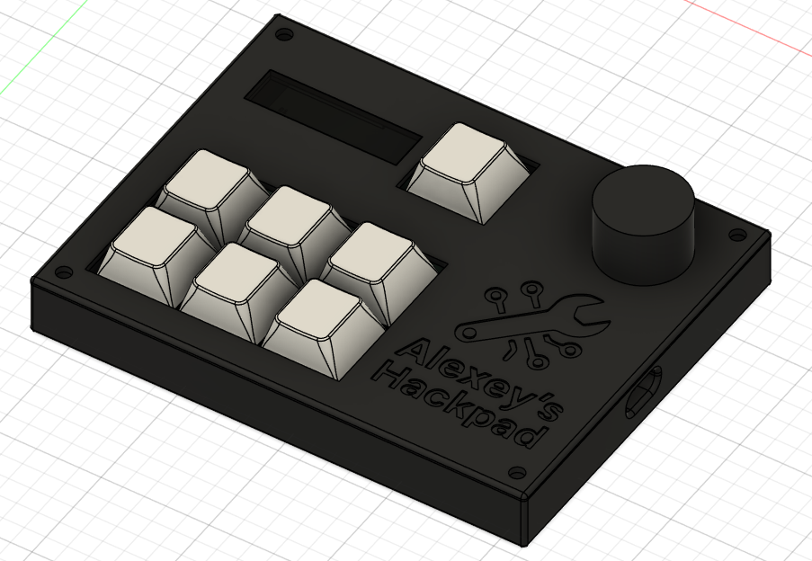
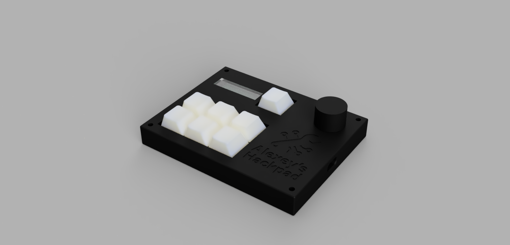
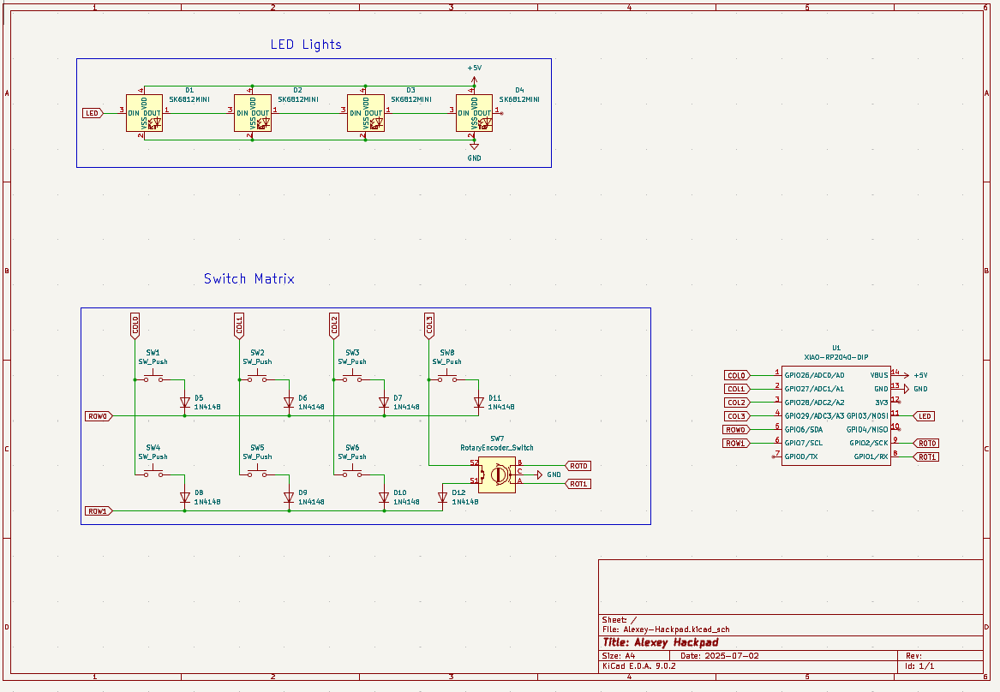
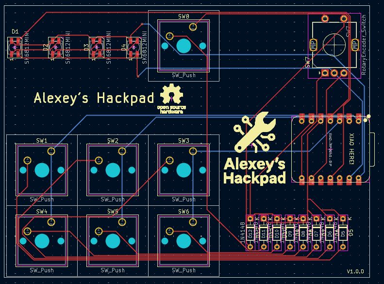

# Alexey-Hackpad

Custom macro pad with 7 keys, an encoder, and an LED light bar, using KMK firmware.

## Features

- 7 keys
  - One key to switch between layers, 6 for macros
- EC11 Rotary encoder with push switch
- LED Light bar displaying custom status
- Custom 2-layer PCB

## CAD Model

### Assembly

### Render

## PCB Design

This PCB was made in KiCad.

### Schematic

### PCB

## Firware

This hackpad uses KMK for its firmware.

- One switch is in charge of switching layers
- Other six keys act as custom macros
- Rotary encoder controls volume and plays/stops music

## BOM

- Seeed XIAO RP2040
- 7x Cherry MX Switches
- 7x DSA Keycaps
- 1x EC11 Rotary encoder
- 1x Rotary enoder knob (3d-printed)
- 4x SK6812 MINI-E LEDs
- 8x Through-hole 1N4148 Diodes
- 4x M3x5x4 Heatset inserts
- 4x M3x16mm screws
- 1x Case (3, 3d-printed parts)
